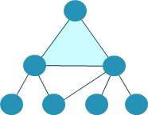

Features & Benefits
*******************

Towalink interconnects multiple sites securely and flexibly. It can be considered an "SD-WAN light", a multi-site connectivity solution with central configuration.

Towalink is built around proven technology like BGP routing (using Bird), VPN tunnels (WireGuard) and Ansible to therewith deliver a powerful but still simple connectivity solution.

Topologies
==========

Towalink is completely flexible regarding network topologies.

Full-Mesh Topology: Each site is connected to every other site.

Star Topology: Each site is connected to a central site.

Any Other Topology: Each site is connected to other sites as needed.

Simple Management
=================

A Towalink installation is managed centrally.

* Fast deployment; the solution is easy to provision and to operate
* Convenient, central configuration and management

The Towalink Controller is the central place of configuration for your Towalink installation. It is also the central place to collect status information and monitoring information from the individual Nodes. Note that user traffic does not run through the Controller.

Failsafe
========

Towalink is reliable: site connectivity operates autonomously, i.e. independently of the Controller.

* Connectivity still fully working when Controller not reachable for whatever reasons
* No complex highly-available controller needed like in other solutions

This eases operation considerably compared to other solutions.

Proven Technology
=================

Towalink builds upon proven, state-of-the art networking technology.

* Supports IPv4 and IPv6 to support any current networking setup
* Builds upon WireGuard: fast & secure VPN tunnels - the state-of-the-art rising star for fast and secure VPN connectivity
* Uses BGP to provide scalable dynamic routing
* Employs BFD (bidirectional forwarding detection) to almost instantaneously detect broken links and foster rerouting

Towalink builds upon proven, state-of-the art open source solutions used worldwide.

* LINUX - Operating Platform
* WireGuard - Secure traffic tunnels
* Bird - BGP-based Dynamic Routing
* Ansible - Configuration Management

...and much more great open source software.

Infrastructure-Agnostic
=======================

Towalink runs on arbitrary access technologies and supports high bandwidths even on low-cost hardware.

* Access-Technology-Agnostic: Can be used on top of any Internet access (even ones restricted by DS-Lite if they can reach their direct peers)
* Fast & Efficient: High bandwidths, usually reaching Internet access speeds, even on cost-efficient hardware

The Towalink Controller can be hosted on premise or in the public cloud, as desired.

Open & Trustworthy
==================

* DSGVO-compliant
*  built by network engineers at heart
* no backdoors
* no untrusted vendors
* no closed box

Flexible
========

You may use the full power of WireGuard and Bird by managing configuration hierarchically (global scope, site scope, node scope) and adapting configuration flexibly using Jinja2 templates.
